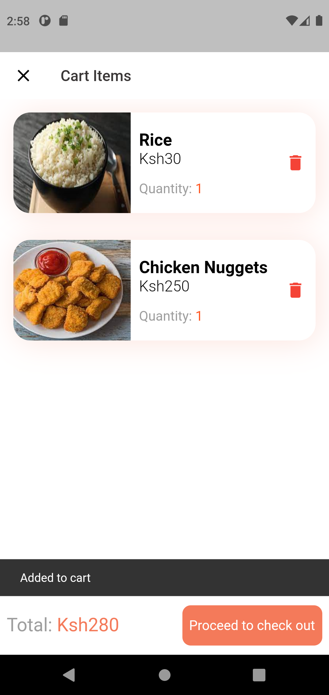

# mealmagic

APT3065-A Mid-term Project for Fall Semester 2021. A food ordering app for SMEs.

# Features

A user is able to:

* Sign up if they are a new user
* Log in
* Browse several food vendors
* Select items from a vendor’s menu
* Make an order with selected items
* Place an order
* Specify the payment method they would like to use
* Specify which address they would like the food delivered to

# What I Learned

* How to design and build cross-platform mobile applications
* Using Google's Firebase for user authentication
* Using Google's Firebase as a backend database

# Screenshots

### Sign in & Sign up Screen

 &nbsp;&nbsp;&nbsp;&nbsp; 

### Home Page

### Restaurant

### Food Details Screen & Add To Cart Screen

 &nbsp;&nbsp;&nbsp;&nbsp; 

# License

This project is licensed under the MIT license - see the
[LICENSE.md](https://github.com/eric-mahasi/mealmagic/blob/main/LICENSE.md)
for details.

# Acknowledgments

* The design for this app was inspired
  by [this kit](https://fluttermarket.com/view/flutter-restaurant-theme)
  and [this one](https://github.com/Tarikul711/flutter-food-delivery-app-ui)
  by [Md Tarikul Islam](https://github.com/Tarikul711)
* I adapted the backend functionality
  from [this project](https://github.com/Santos-Enoque/food_app_course)
  by [Santos Enoque](https://github.com/Santos-Enoque)
* Photo and icon credits to [freepik](https://www.freepik.com/)
  and [flaticon](https://www.flaticon.com/)
